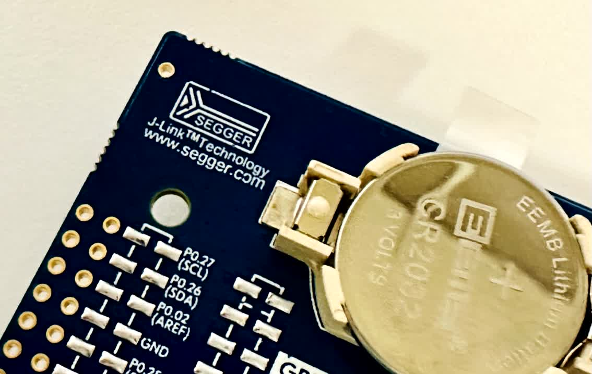
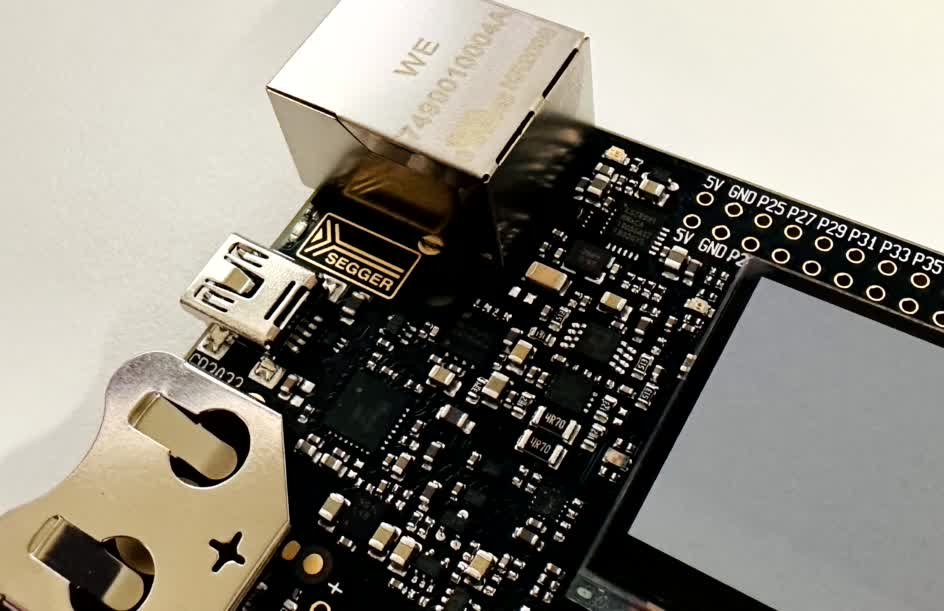

Segger? J-Link?  

   

 
일단 J-Link가 무엇인지 부터 알아보기로 했다.  
Simplicity studio 등, 주변에서 쉽게 찾아볼 수 있는 J-Link.  
각종 development kit에서도 내장되어있다고 한다.
최근에 구입한 Nordic nRF52 DK는 물론, Silicon labs의 BRD4001A starter kit에서도 찾아볼 수 있다.  

  

  

작성 중

  
