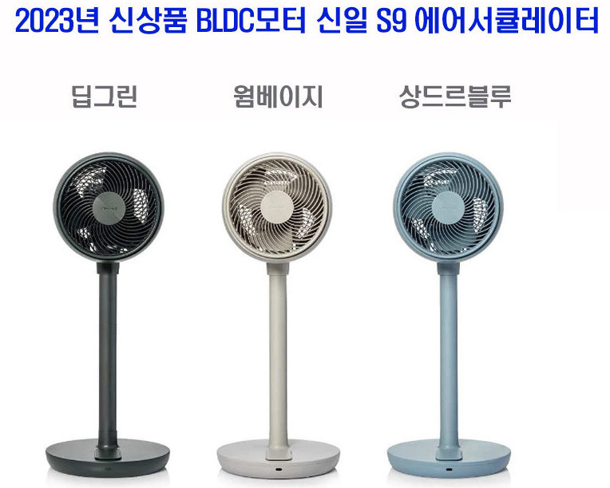
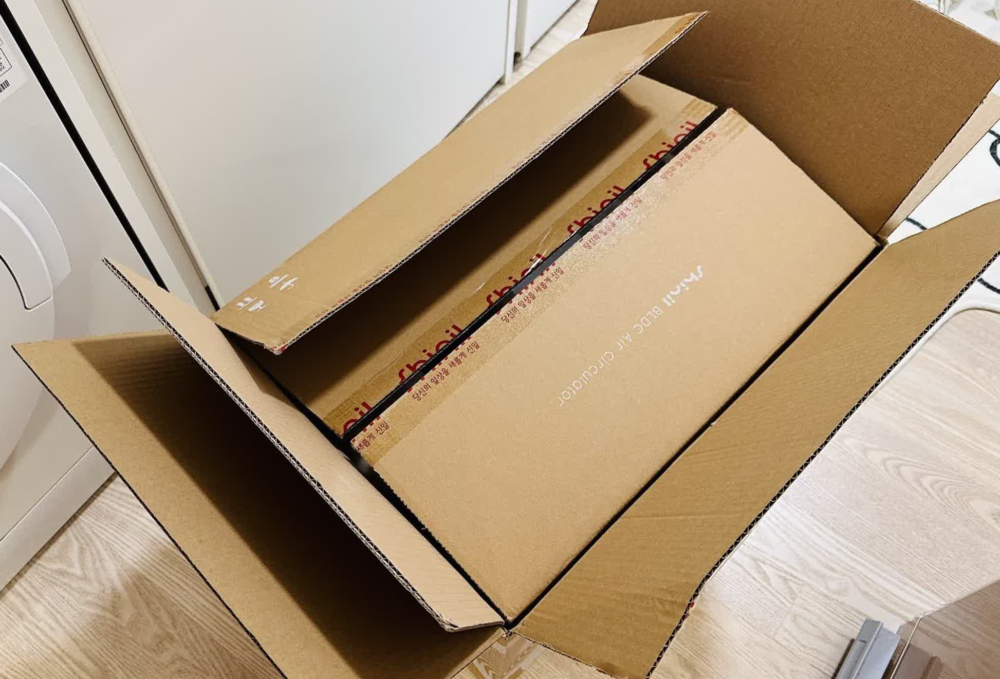
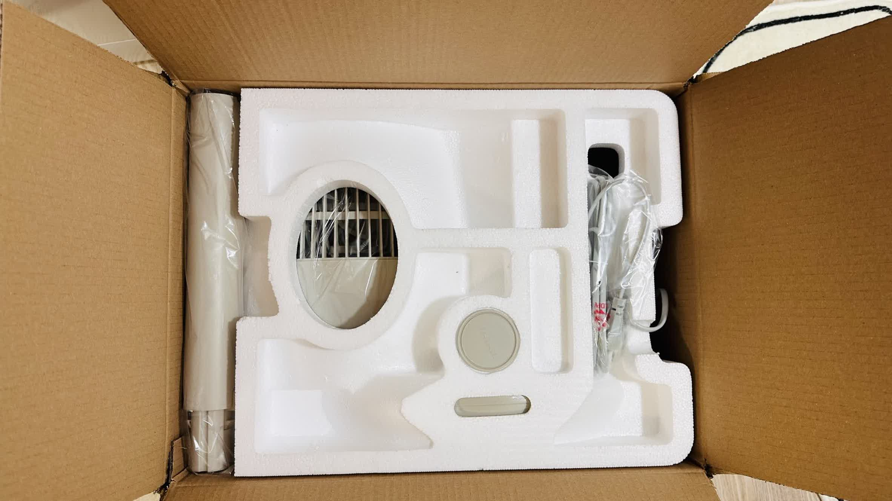
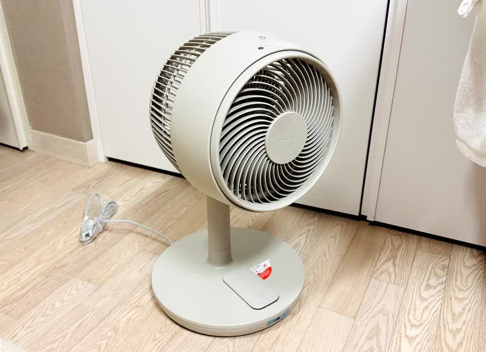
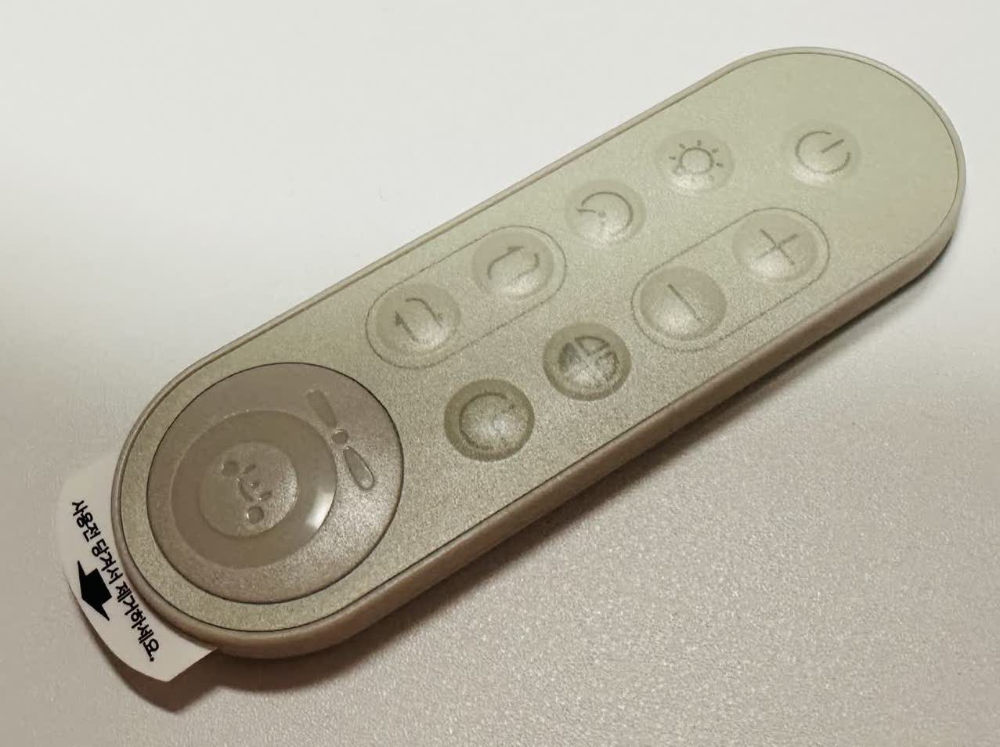
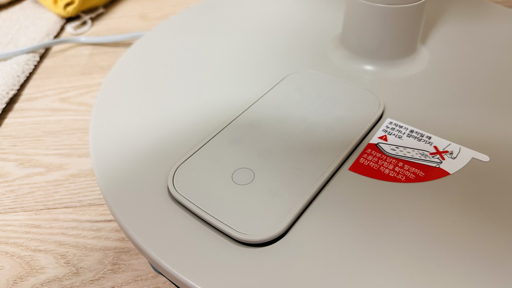
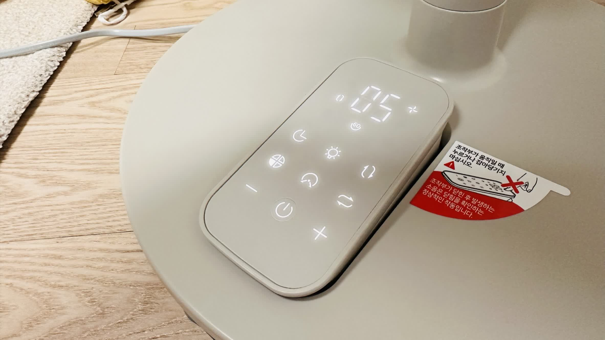
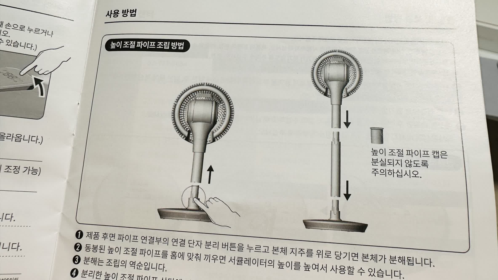
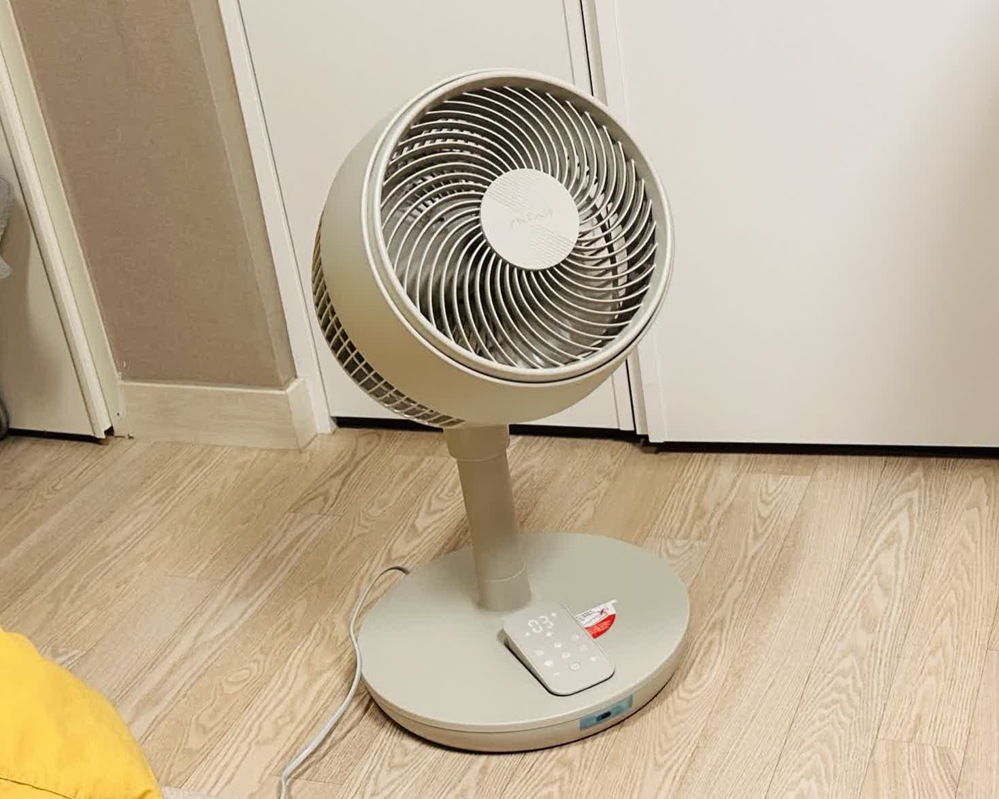
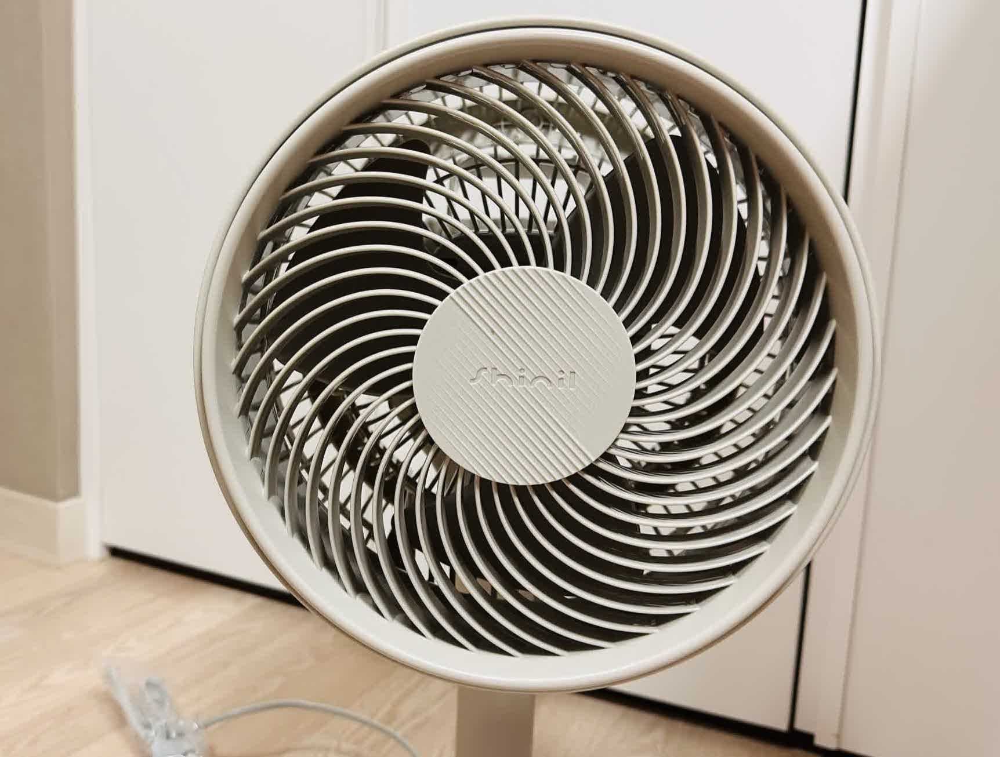

내돈내산 신일 S9 에어서큘레이터 구매 후기 

   

 
장마철 실내 빨래 건조를 위해 에어서큘레이터를 알아보던중 신일에서 새로 나온 제품을 골랐다.  
선풍기로 이름날리던 신일이라 그런지 같은 에어서큘레이터도 잘 만들고 있는거 같았다.  
알아보던 중 2023년형으로 나온 S9 모델을 선택하였고 월요일 오전에 주문하여 다음날 오후에 받아볼 수 있었다.  
따끈따끈한 모델인지 주문하자마자 매진... 뭔가 행복.. 
그리고 색상은 아래와 같이 세가지로 출시되었다고 한다.  
나는 웜베이지를 선택했으며 제품명은 SIF-CS30BG.  
상드르블루도 뭔가 실물로보면 이쁠거같다.
  

 
배송은 상자에 이중 포장되어서 왔고 제품 상태도 좋았다.  
크기가 크지 않아서 로비의 택배함에 들어가더라...  
  
  

 
나는 웜베이지를 선택했고 실물은 색상명 그대로 짙은 베이지 였다.  
  
귀여운 리모컨도 있다... 개인적으로 리모컨은 보통 자다가 사용하는 경우도 많기 때문에  
버튼에 LED가 들어오면 좋겠다..😢   
  
작년 모델과 다른 점은 아래 사진과 같이 전원을 켜면 조작부가 위로 올라온다.  
구매전에 설명을 보고 '굳이...?' 싶었는데 실제로 보니 나름 멋있다...🫢🫢🫢  
  
  
그리고 위쪽 구동부와 하판 사이에 높이 조절 파이프를 껴서 높이를 더 높일 수 있다.  
  

 
높이 조절 파이프 없이 그냥 사용하면 작은 아이가 주변을 요리죠리 둘어보는 거 같다.  
  
  

 
바람세기는 1~14단계까지 있고 3단까지는 모터돌아가는 소리도 안들린다.  
4단계부터 아주 살짝 들리기 시작하며 14단계에서는 일반 선풍기 2단정도?의 소리가 나는거 같다.  
일반 가정집의 거실에서는 10단까지도 소리가 안 들릴거같다.  
그리고 상하좌우를 활성화하면 S자로 훑으며 올라갔다 내려갔다 한다.  
'웜'베이지인걸 인지하지 못하고 옅은 베이지를 생각하고 구매해서 아쉽지만 멀리서보면 또 나름 이쁘다.  
이렇게 처음으로 구매해본 에어서큘레이터는 아주 대만족인 것으로💃🕺

  
