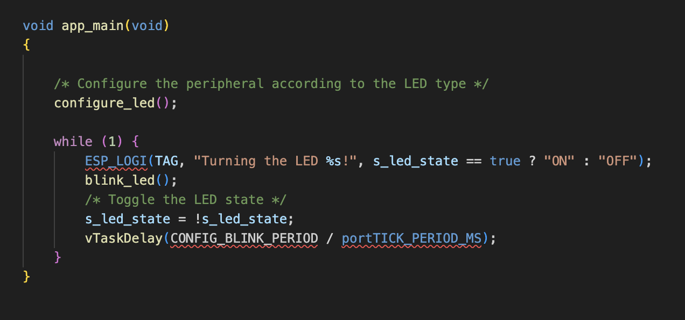
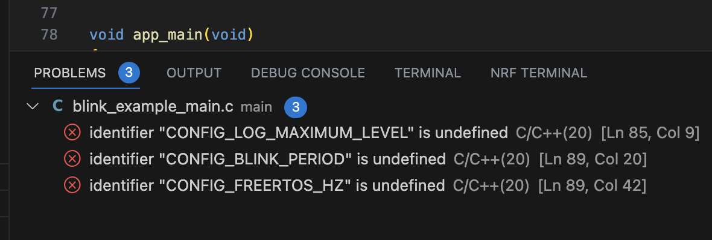

identifier "CONFIG_LOG_MAXIMUM_LEVEL" is undefined  
identifier "CONFIG_BLINK_PERIOD" is undefined  
identifier "CONFIG_FREERTOS_HZ" is undefined  
  
    

#### 증상  
<span style="font-size:11pt"> 
vscode를 이용한 esp32 example 빌드 중에 아래와 같이 header와 값들을 못 읽어오는 현상이 발생.  
</span>
  
  
<span style="font-size:11pt"> 
아래는 기존 에러가 발생하던 코드.
</span>
  
```c_cpp_properties.json
{
    "configurations": [
        {
            "name": "ESP-IDF",
            "compilerPath": "/Users/jinhyeok/.espressif/tools/xtensa-esp32s3-elf/esp-2022r1-11.2.0/xtensa-esp32s3-elf/bin/xtensa-esp32s3-elf-gcc",
            "includePath": [
                "${config:idf.espIdfPath}/components/**",
                "${config:idf.espIdfPathWin}/components/**",
                "${config:idf.espAdfPath}/components/**",
                "${config:idf.espAdfPathWin}/components/**",
                "${workspaceFolder}/**"
            ],
            "browse": {
                "path": [
                    "${config:idf.espIdfPath}/components",
                    "${config:idf.espIdfPathWin}/components",
                    "${config:idf.espAdfPath}/components/**",
                    "${config:idf.espAdfPathWin}/components/**",
                    "${workspaceFolder}"
                ],
                "limitSymbolsToIncludedHeaders": false
            },
            "intelliSenseMode": "macos-gcc-arm64"
        }
    ],
    "version": 4
}
```

#### 해결 방법  
<span style="font-size:11pt">
c_cpp_properties.json 내용을 아래와 같이 수정.  
compilerPath는 기존 code의 것을 사용.
</span>
```c_cpp_properties.json
{
    "configurations": [
      {
        "name": "ESP-IDF",
        "compilerPath": "/Users/jinhyeok/.espressif/tools/xtensa-esp32s3-elf/esp-2022r1-11.2.0/xtensa-esp32s3-elf/bin/xtensa-esp32s3-elf-gcc",
        "cStandard": "c11",
        "cppStandard": "c++17",
        "includePath": [
          "${config:idf.espIdfPath}/components/**",
          "${config:idf.espIdfPathWin}/components/**",
          "${config:idf.espAdfPath}/components/**",
          "${config:idf.espAdfPathWin}/components/**",
          "${workspaceFolder}/**"
        ],
        "browse": {
          "path": [
            "${config:idf.espIdfPath}/components",
            "${config:idf.espIdfPathWin}/components",
            "${config:idf.espAdfPath}/components/**",
            "${config:idf.espAdfPathWin}/components/**",
            "${workspaceFolder}"
          ],
          "limitSymbolsToIncludedHeaders": false
        },
        "configurationProvider": "ms-vscode.cmake-tools",
        "compileCommands": "${workspaceFolder}/build/compile_commands.json"
      }
    ],
    "version": 4
  }
```

<span style="font-size:11pt">
정보 출처 : https://github.com/espressif/vscode-esp-idf-extension/issues/672
</span>
